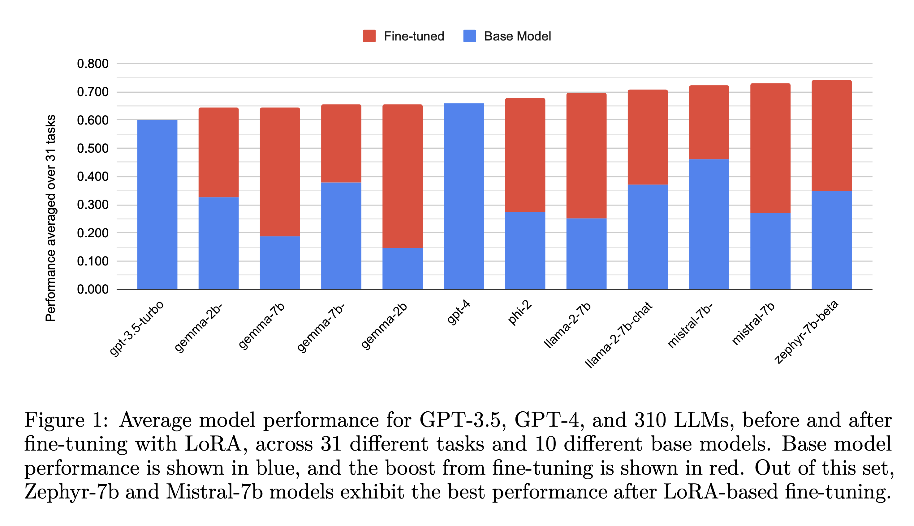
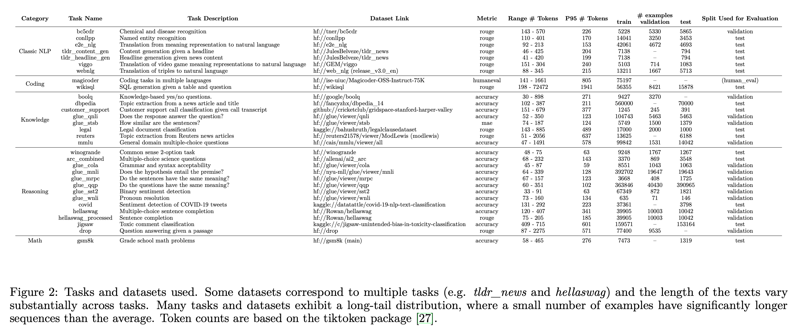
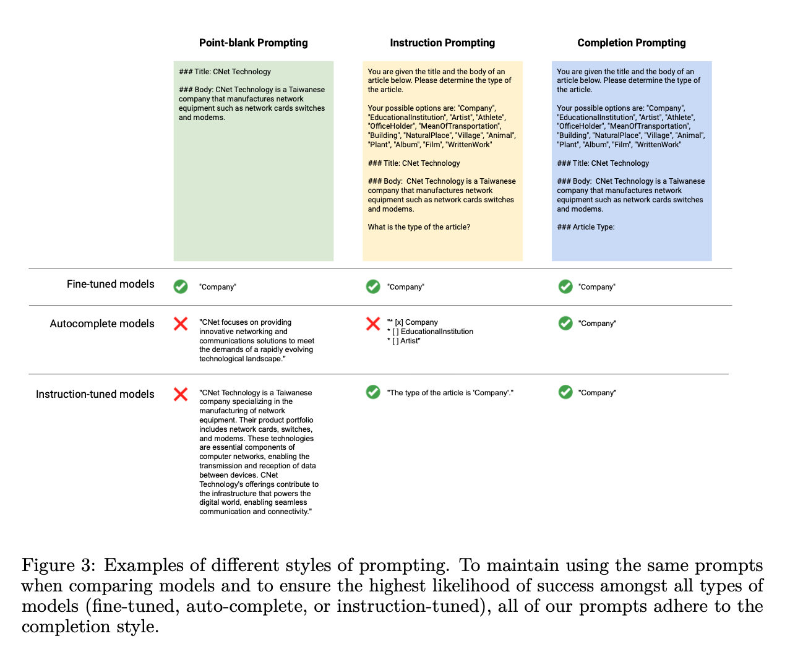
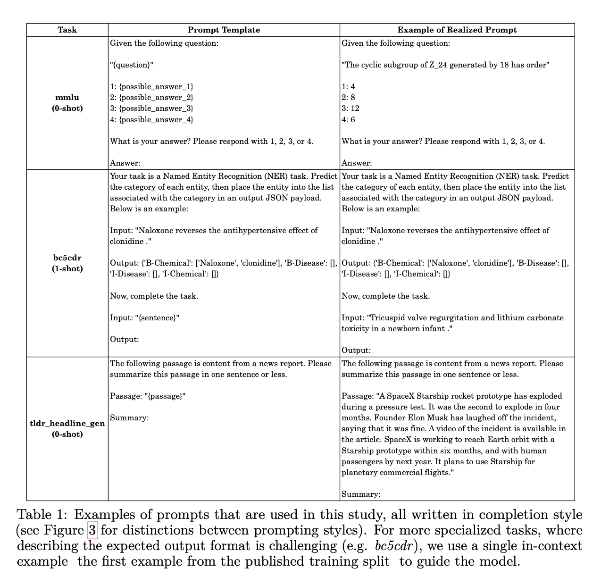
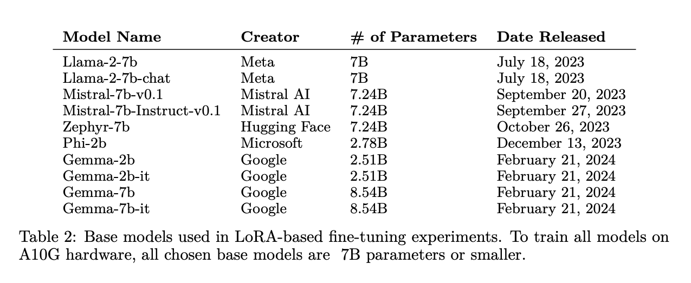
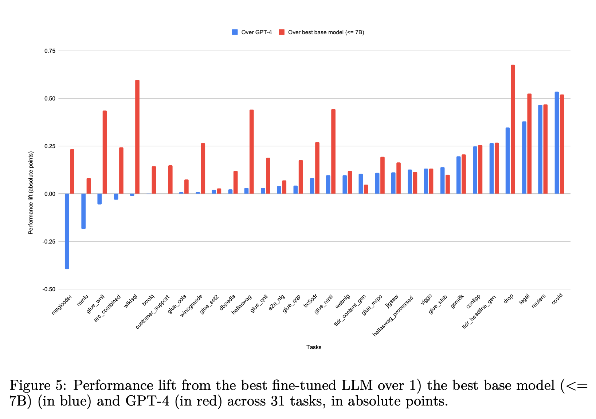
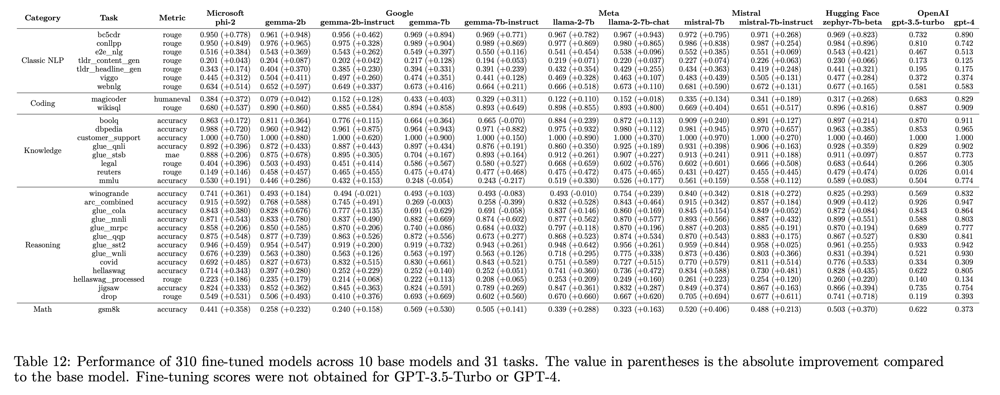
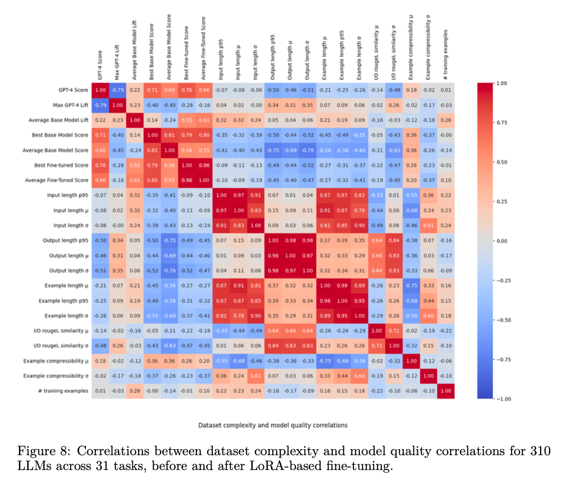
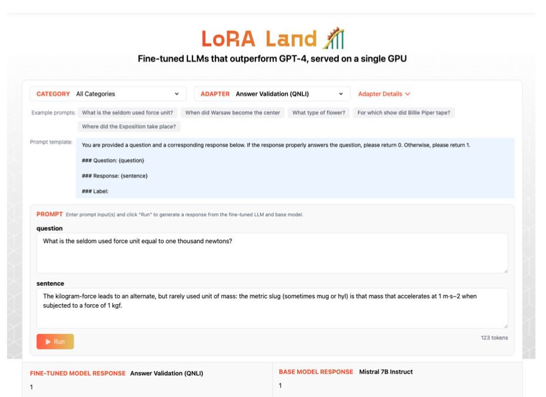

# Lora Land: 310 Fine-tuned LLMs that Rival GPT-4

- Full technical report. (TODO: Add arxiv link).
- [LoRA Land web application](https://predibase.com/lora-land).
- [LoRA Land blog post](https://predibase.com/blog/lora-land-fine-tuned-open-source-llms-that-outperform-gpt-4).



Low Rank Adaptation (LoRA) has emerged as one of the most widely adopted methods
for Parameter Efficient Fine-Tuning (PEFT) of Large Language Models (LLMs). LoRA
reduces the number of trainable parameters and memory usage while achieving comparable
performance to full fine-tuning. We aim to assess the viability of training and serving LLMs
fine-tuned with LoRA in real-world applications. First, we measure the quality of LLMs
fine-tuned with quantized low rank adapters across 10 base models and 31 tasks for a total of
310 models. We find that 4-bit LoRA fine-tuned models outperform base models by 34 points
and GPT-4 by 10 points on average. Second, we investigate the most effective base models
for fine-tuning and assess the correlative and predictive capacities of dataset complexity
heuristics in forecasting the outcomes of fine-tuning. Finally, we evaluate the latency and
concurrency capabilities of [LoRAX](https://github.com/predibase/lorax), an open-source LLM serving framework that facilitates
the deployment of multiple LoRA fine-tuned models on a single GPU using shared base
model weights and dynamic adapter loading. We use LoRAX to develop [LoRA Land](https://predibase.com/lora-land), a
web application that hosts 25 LoRA fine-tuned Mistral-7B LLMs on a single NVIDIA A100
GPU with 80GB memory. This demonstration highlights the quality and cost-effectiveness
of employing multiple specialized LLMs over a single, general-purpose LLM.

## Tasks

The preprocessing code, prompt templates, and splits for all of our experiments can be found in the `datasets/` directory.



## Prompt design





## Base models



## Results





## Meta-correlations betweendataset complexity and model quality



## Evaluation Harness

To use this eval harness, please set your `PREDIBASE_API_TOKEN` in `.env` before running the harness.

In the `tasks` directory, there is a subdirectory named `glue_sst2`, and inside of that subdirectory, there is a file named `metadata.yaml`. This is an example of the task-based organizational structure that the harness relies on. To add another task to the directory, it must follow the same convention: `tasks/{task_name}/metadata.yaml`.

The `metadata.yaml` file includes metadata like:
- `data_path`: the path to the relevant dataset
- `prompt_template`: the prompt template
- `target_col`: the target column
- `metric_name`: the metric function to use
- `split_column`: the name of the column that defines splits in the dataset (optional)
- `split_column_value`:which split to use (optional)

In the `eval/glue_sst2` directory, the `run.sh` script serves as an example script to follow for other evaluations. There are three components of the script:
- `prep_pbase_requests.py` -- Generates the JSON payloads to the REST API
- `pbase_request_parallel_processor.py` -- Calls the REST API to get the responses from an adapter
- `parse_responses.py` -- Calculates a metric score over the responses from the adapter (metrics listed in `metric_fns.py`)

In particular, the `task` flag refers to the name of the subdirectory containing the relevant `metadata.yaml` file.

To run the `run.sh` script, you will need to:
1. Train your own adapter on the provided dataset and switch out the `adapter_id` parameter in the script with the model repo name and model version of your fine-tuned adapter.
2. Change the `deployment_base_model` parameter to the name of the deployment you would like to use
3. Change the `tenant_id` parameter to your tenant ID.

These three parameters can be found in the Predibase UI under "Models", "Prompt", and "Settings", respectively.

## LoRAX Benchmarking

See `lorax_load_test.js`.

Sample command:

```
k6 run --env CONCURRENT_REQUESTS=2 --env NUM_INPUT_WORDS_LOWER_BOUND=90 --env NUM_INPUT_WORDS_UPPER_BOUND=110 --env MAX_NEW_TOKENS_LOWER_BOUND=90 --env MAX_NEW_TOKENS_UPPER_BOUND=110 --env SERVING_GATEWAY=serving.app.predibase.com --env TENANT=fd6c79 --env DEPLOYMENT_NAME=llama-2-7b-chat --env AUTH_TOKEN=pb_jcN0OPMdWt-yrgIg0aBnTA load_test.js
```

## Web application

[LoRA Land](https://predibase.com/lora-land)




## Citation

```
@misc{loraland2024,
    title = {LoRA Land: 310 Fine-tuned LLMs that Rival GPT-4, A Technical Report},
    url = {https://predibase.com/blog/lora-land-fine-tuned-open-source-llms-that-outperform-gpt-4},
    author = {Justin Zhao, Timothy Wang, Wael Abid, Geoffrey Angus, Arnav Garg, Jeffery Kinnison, Piero Molino, Travis Addair, Devvret Rishi},
    month = {April},
    year = {2024}
}
```